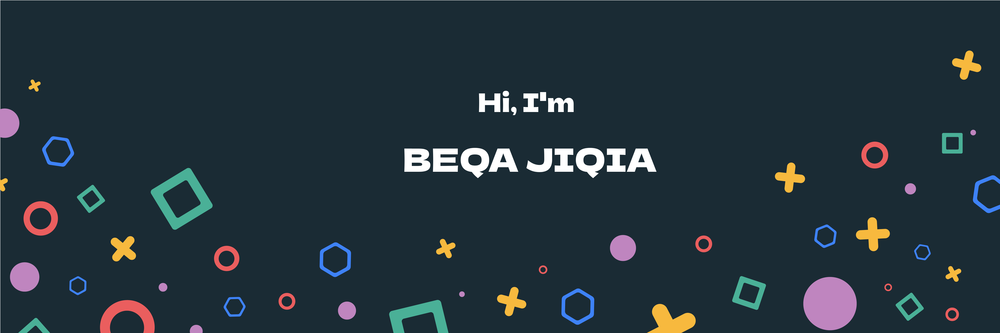

<h2>Hey there! I'm Beqa</h2>

### 👨🏻‍💻 &nbsp;About Me

💡 &nbsp;I love exploring new things and coming up with new things.\
🎓 &nbsp;I am currently teaching programming languages ​​at ItStep, which is one of the leading programming schools in **Georgia** and abroad.\
🌱 &nbsp;I am currently working on a social network (https://www.outplay.ge), which is a *gaming social network* and is distinguished around the world.\
✍️ &nbsp;In my free time I like to play games, have fun with friends, watch videos/TV series/movies or learn a new language.\
💬 &nbsp;Feel free to reach out to me for pro bono consulting and volunteering, or just for some interesting discussion.\
✉️ &nbsp;You can shoot me an email at saintereso056@gmail.com! I'll try to respond as soon as I can.\
📄 &nbsp;Please have a look at my [Résumé](./assets/Developer-Resume.pdf) for more details about me. I'm open to feedback and suggestions!

### 🛠 &nbsp;Tech Stack
&nbsp;
&nbsp;
\
&nbsp;
&nbsp;
&nbsp;
&nbsp;
\
&nbsp;
&nbsp;
&nbsp;
&nbsp;

### ⚙️ &nbsp;GitHub Analytics

### 🤝🏻 &nbsp;Connect with Me

